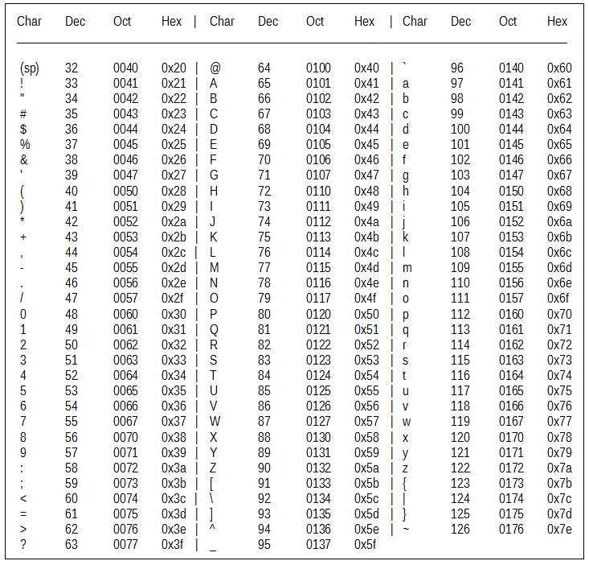

# many-time-pad-attack
Decrypt the challenge ciphertext which was encrypted by one time pad

## Description
All explanations are annotated in the "decrypt.py" code.

```bash
$ python decrypt.py
```

## Key solution
- Upper alphabetic is from 0x41 to 0x5a. Lower alphabetic is from 0x61 to 0x7a
    - 4 XOR 2 = 6 (0100 XOR 0010 = 0110)
    - 5 XOR 2 = 7 (0101 XOR 0010 = 0111)
    - 6 XOR 2 = 4 (0110 XOR 0010 = 0100)
    - 7 XOR 2 = 5 (0111 XOR 0010 = 0101)
- Fortunately, the ASCII of space is 0x20!



- That is, if lower alphabetic from challenge cipher text meets space from other cipher text, it will be showed in same upper alphabetic.
- Also, The upper alphabetic will be showed in same lower alphabetic.
- You can see the demo by execute the bash below.

```bash
$ python test.py
```

## Results
- Decrypt message:

'''
Think of me, think of me fondly when we've said goodbye.
Father once spoke of an angel, I used to dream he'd appear.
Turn your thoughts away from cold unfeeling light and listen
Prima Donna First Lady of the stage! Your devotees are on the
Anywhere you go let me go too. Love me, that's all I ask of y
Masquerade! Hide your face, so the world will never find you!
Dreaming of you won't help me to do all that you dreamed I co
Past the point of no return the final threshold the bridge is
I love her! Does that mean nothing? I love her! Show some com
You alone, can make my song take flight. It's over now, the m
'''

- Challenge message:

'''
Hackers should be judged by their acting, not bogus criteria.
'''

- Whole message (Songs in The Phantom of the Opera)

'''
Think of me, think of me fondly when we've said goodbye.
Father once spoke of an angel, I used to dream he'd appear.
Turn your thoughts away from cold unfeeling light and listen to the music of the night.
Prima Donna First Lady of the stage! Your devotees are on their knees to implore you !
Anywhere you go let me go too. Love me, that's all I ask of you.
Masquerade! Hide your face, so the world will never find you!
Dreaming of you won't help me to do all that you dreamed I could.
Past the point of no return the final threshold the bridge is crossed, so stand and watch it burn.
I love her! Does that mean nothing? I love her! Show some compassion!
You alone, can make my song take flight. It's over now, the music of the night!
'''

## Reference
1. https://www.ibm.com/support/knowledgecenter/SSLTBW_2.3.0/com.ibm.zos.v2r3.ioaq100/ascii_table.gif
